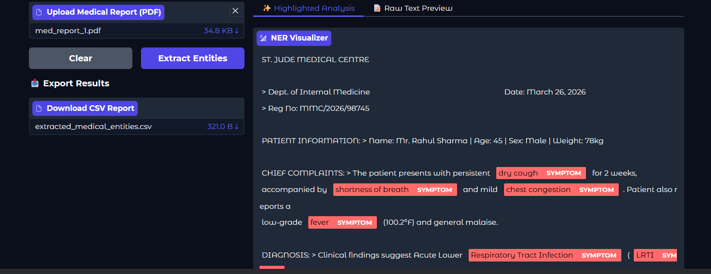
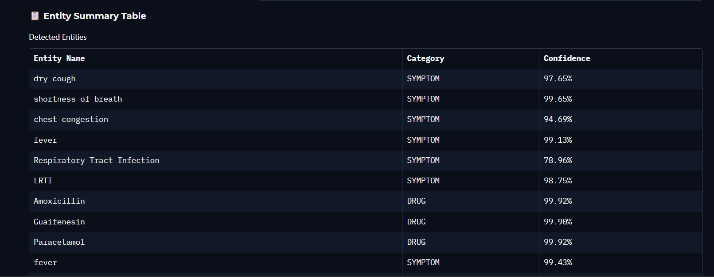

# 🏥 BioBERT Medical Named Entity Recognition (NER) System

An end-to-end Machine Learning pipeline designed to extract clinical entities—specifically **Drugs** and **Symptoms**—from medical PDF reports using a fine-tuned **BioBERT** model.

---

🌟 Key Features
    Custom Token Alignment: Solves WordPiece subword tokenization shifts by masking sub-tokens with -100 during training.

    Smart Entity Merging: Combines fragmented subword outputs (e.g., "Am" + "oxicillin") into unified entities.

    Interactive UI: Built using Gradio for visual text highlighting, raw text previews, and summary tables.

    Export Options: One-click CSV download for downstream clinical analysis.

---

## 📸 System Overview & Results

### 1. Operational Workflow
Below is the architectural and operational workflow of the complete pipeline:


---

### 2. Interactive Gradio UI & Entity Visualizer
The model processes uploaded clinical PDF reports in real time, highlighting extracted entities and generating structured tables with high confidence scores.

| Highlighted Analysis View | Entity Summary Table |
| :---: | :---: |
|  |  |

---

## 📊 Model Performance & Metrics

The fine-tuned BioBERT model was trained across 3 epochs, reaching an overall **F1-score of ~0.886** on validation and strong generalization on test evaluation:

### Training Progress Across Epochs
| Epoch | Training Loss | Validation Loss | Precision | Recall | F1-Score |
| :---: | :---: | :---: | :---: | :---: | :---: |
| **1** | 0.063990 | 0.105952 | 0.8448 | 0.8824 | 0.8631 |
| **2** | 0.041033 | 0.110324 | 0.8704 | 0.8953 | 0.8827 |
| **3** | **0.023084** | **0.127267** | **0.8729** | **0.9003** | **0.8864** |

---

### Test Set Classification Report
```text
              precision    recall  f1-score   support

        DRUG       0.91      0.93      0.92      5379
     SYMPTOM       0.79      0.86      0.82      4423

   micro avg       0.85      0.90      0.87      9802
   macro avg       0.85      0.89      0.87      9802
weighted avg       0.85      0.90      0.87      9802 


